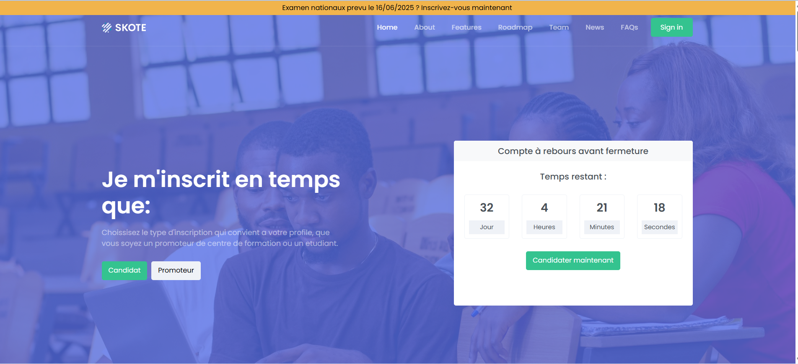

🧠 Online Application Platform — Monorepo
Welcome to the Online Exams Application Platform!
This project manages Candidates, School Directors, and National Exam Board Staff within a unified full-stack system using:

Backend: Java 21, Spring Boot

Frontend: Angular

Database: MySQL

Orchestration: Docker Compose

Architecture: Monorepo (single repository for frontend + backend + infra)

📂 Project Structure
/
├── applycam(backend)/            # Spring Boot Application (API server)
├── Admin(frontend)/           # Angular Application (Client app)
├── docker-compose.yml  # Docker Compose Orchestration
├── Dockerfile.backend  # Backend Dockerfile
├── Dockerfile.frontend # Frontend Dockerfile
└── README.md           # This file

⚙️ Requirements
Make sure you have the following installed:

Docker

Docker Compose

(Optional) Node.js and Angular CLI if you want to run frontend locally without Docker

(Optional) Java 21 and Maven if you want to run backend locally without Docker

🚀 How to Run the Fullstack Project

1. Clone the repository:
git clone https://github.com/your-organization/your-project.git
cd your-project

2. Start all services with Docker Compose:
docker-compose up --build

✅ This will:

Build and run the backend container

Build and run the frontend container

Run MySQL database with initialized schema

Access the applications:

Frontend (Angular app):
http://localhost:8080

Backend API (Spring Boot app):
http://localhost:8088/api/v1

MySQL Database:
Host: localhost,
Port: 3306,
Database: applycam

